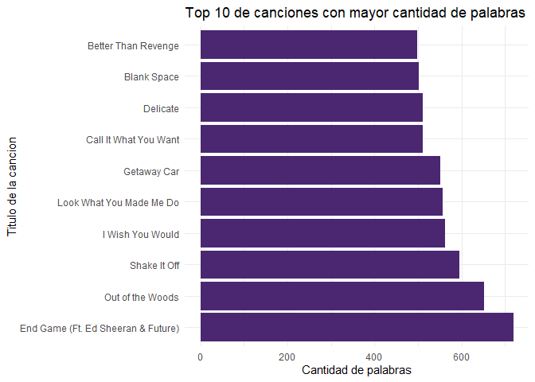
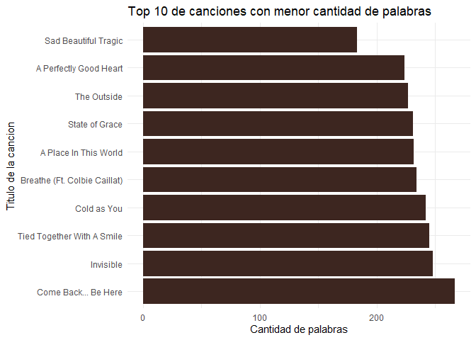
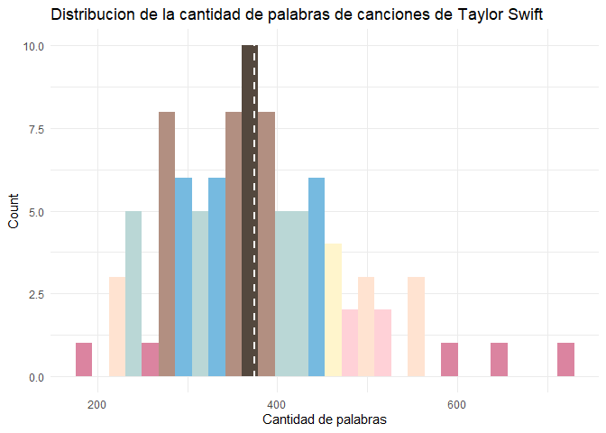

Taylor Swift Viz
================
Natalia Esquenazi
11/12/2021

## Objetivo

Este analisis tiene el objetivo de estudiar cuantitativamente el las
canciones y albumbs de Taylor Swift, artista a la cual admiro por su
trabajo en defensa de los derechos de las mujeres y diversidades.

La motivacion principal esta orientada a generar visualizaciones a
partir de un dataset con letras de sus canciones y el paquete
TayloRswift con colores caracteristicos de los albums de la artista.


## Analisis Exploratorio

Primero instalamos las siguientes librerias:

``` r
library(tidyverse)
```

    ## -- Attaching packages --------------------------------------- tidyverse 1.3.0 --

    ## v ggplot2 3.3.3     v purrr   0.3.4
    ## v tibble  3.1.0     v dplyr   1.0.5
    ## v tidyr   1.1.3     v stringr 1.4.0
    ## v readr   1.3.1     v forcats 0.5.1

    ## -- Conflicts ------------------------------------------ tidyverse_conflicts() --
    ## x dplyr::filter() masks stats::filter()
    ## x dplyr::lag()    masks stats::lag()

``` r
library(dplyr)
library(tidyr)
library(ggplot2)  
library(plotly)
```

    ## 
    ## Attaching package: 'plotly'

    ## The following object is masked from 'package:ggplot2':
    ## 
    ##     last_plot

    ## The following object is masked from 'package:stats':
    ## 
    ##     filter

    ## The following object is masked from 'package:graphics':
    ## 
    ##     layout

``` r
library(readr)
```

Para descargar el paquete de Taylor Swift hay que hacerlo de la
siguiente manera:

``` r
#install.packages("tayloRswift")
library(tayloRswift)
```

El dataset de letras de musica cuenta con 4862 observaciones y las
siguientes variables:

  - artist
  - album
  - track\_title
  - track\_n
  - lyric
  - line
  - year

Empecemos cargando el dataset, usando las herramientas que nos da
Tidyverse.

``` r
df <- read_csv("taylor_swift_lyrics.csv")
```

    ## Parsed with column specification:
    ## cols(
    ##   artist = col_character(),
    ##   album = col_character(),
    ##   track_title = col_character(),
    ##   track_n = col_double(),
    ##   lyric = col_character(),
    ##   line = col_double(),
    ##   year = col_double()
    ## )

Primero me voy a quedar con el top 10 de canciones que tengan mayor
cantidad de palabras y luego agrupamos la cantidad de palabras
detectadas por titulo de cancion.

``` r
df$length <- str_count(df$lyric,"\\S+")
```

``` r
length_df <- df %>%
group_by(track_title) %>%
summarise(length = sum(length))
```

Voy a realizar la primera visualizacion con colores de la paleta
SpeakNow\!

``` r
plot_1 <- length_df %>%
  arrange(desc(length)) %>%
  slice(1:10) 

plot_1 %>% 
  ggplot(aes(x= reorder(track_title, -length), y=length)) +
    geom_bar(stat="identity", fill="#4b2671")+
    coord_flip()+
    ylab("Cantidad de palabras") + 
    xlab ("Titulo de la cancion") +
    ggtitle("Top 10 de canciones con mayor cantidad de palabras") +
    theme_minimal() 
```

<!-- -->

En el grafico podemos observar el top 10 de canciones con mayor cantidad
de palabras de Taylor Swift, en la cual “End Game” es una de las mas
largas\!

Ahora en una segunda visualizacion obervo el top 10 de canciones con
menor cantidad de palabras y la paleta de colores de Evermore.

``` r
plot_2 <- length_df %>%
  arrange(length) %>%
  slice(1:10) 

plot_2 %>% 
  ggplot(aes(x= reorder(track_title, -length), y=length)) +
    geom_bar(stat="identity", fill="#3d2620")+
    coord_flip()+
    ylab("Cantidad de palabras") + 
    xlab ("Titulo de la cancion") +
    ggtitle("Top 10 de canciones con menor cantidad de palabras") +
    theme_minimal() 
```

<!-- -->

Finalmente observo la distribucion de la cantidad de palabras de las
canciones con la paleta Lover.


``` r
plot_3 <- ggplot(data = length_df,
                 mapping = aes(x = length)) + 
          geom_histogram(bins = 30, aes(fill = ..count..))+
          geom_vline(aes(xintercept=mean(length)), color="#FFFFFF", linetype="dashed", size=1)+
          theme_minimal()+
          scale_fill_taylor(palette = "lover", guide = "none", discrete = FALSE)+
          ylab("Count") + 
          xlab ("Cantidad de palabras") +
          ggtitle("Distribucion de la cantidad de palabras de canciones de Taylor Swift")
plot_3
```

<!-- -->

En el grafico observamos que Taylor Swift tiene pocas canciones con 600
palabras o mas, al igual que 200 palabras o menos. El promedio de
cantidad de palabras se ubica en 375 aproximadamente.
